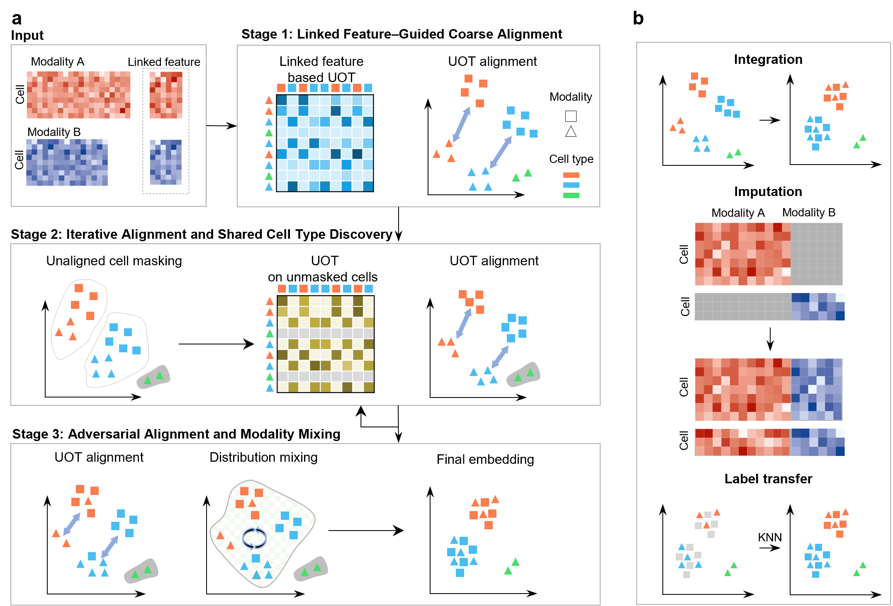

# UniDISA




## Overview

**UniDISA** (**Uni**fied framework for **Di**agonal **I**ntegration via **S**tagewise **A**lignment) is a computational framework for robust cross-modal integration of single-cell multi-omics data.

**a** Schematic of the UniDISA framework. Input comprises two pairs of feature matrices: full features and shared link features for each modality. Integration proceeds in three stages. Stage 1: unbalanced optimal transport (UOT) is calculated using distances in the link feature space, yielding a transport plan for cell alignment. Stage 2: Leiden clustering is applied to the link feature-guided embedding; clusters containing cells from only one modality are masked. UOT is recomputed on unmasked cells using distances in the refined embedding, followed by iterative cell alignment and embedding optimization. Stage 3: final alignment is performed on unmasked cells, with an adversarial loss promoting modality mixing.

**b** Downstream analytical tasks enabled by UniDISA, including cross-modal integration, feature imputation, and cross-modal cell type label transfer.


## Installation
The UniDISA package is developed based on the Python libraries [Scanpy](https://scanpy.readthedocs.io/en/stable/) and [PyTorch](https://pytorch.org/), and can be run on GPU (recommend) or CPU.


First clone the repository. 

```
git clone https://github.com/whitezb12/UniDISA.git
cd UniDISA
```

It's recommended to create a separate conda environment for running UniDISA:

```
#create an environment called UniDISA
conda create -n UniDISA python=3.10

#activate your environment
conda activate UniDISA

#install UniDISA
pip install .
```


## Tutorials

Three step-by-step tutorials are included in the `Tutorial` folder.
Datasets are available on https://drive.google.com/drive/folders/1pVxUQ5uwa-txwE4LvjaPzKrVirYA5LbQ?usp=drive_link.

- [Tutorial 1: RNA + ATAC Integration (Muto-2021)](./Tutorial/RNA+ATAC_Muto-2021.ipynb)
- [Tutorial 2: RNA + ADT Integration (TEA-seq)](./Tutorial/RNA+ADT_TEA-seq_PBMC.ipynb)


## Support
If you have any questions, please feel free to contact us [22110180029@m.fudan.edu.cn](mailto:22110180029@m.fudan.edu.cn). 


## Citation
Zhengfang Lu, Biao Zhang and Shuqin Zhang. "UniDISA". 2026.

